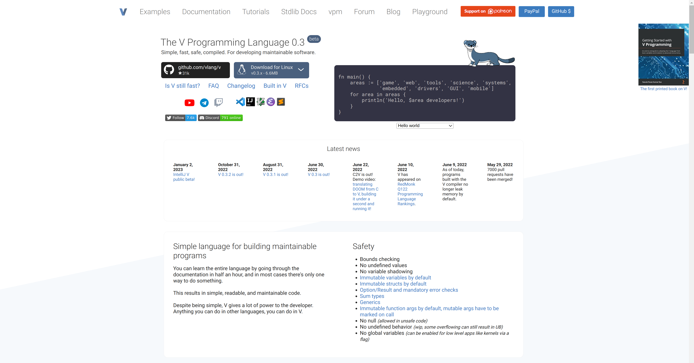

\
The npm thingy creates pages from njk files (templates), converts sass to css and runs the page on **localhost:3000** via **serve**\
commands:
```
npm install
npm install --global serve
npm run build
```